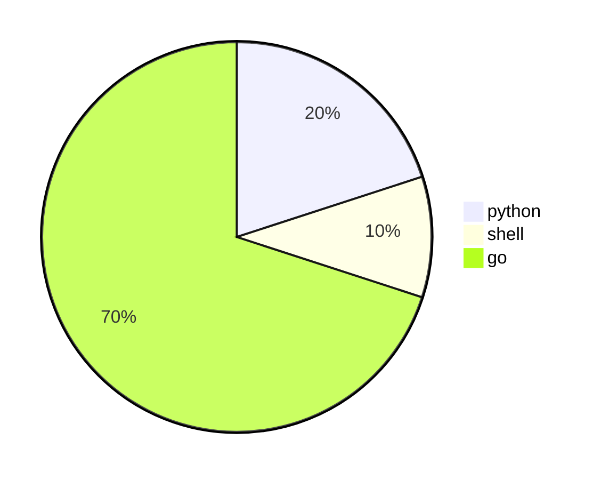

# markdown的基本用法
快速上手markdown语法，本文会演示一些常用的markdown语法。保证你看完之后能够快速上手。

## 标题
在需要设置标题的文字前面加#来形成标题。在#结束的时候添加空格和标题 分开，最多支持六级标题。下面是实例。
``` 
# 一级标题
## 二级标题
### 三级标题
#### 四级标题
##### 五级标题
###### 六级标题
```
* 示例
# 一级标题
## 二级标题
### 三级标题
#### 四级标题
##### 五级标题
###### 六级标题
## 字体
字体的用法主要有斜体，加粗，斜体加粗，加删除线

### 加粗
前后两个*将文字包裹起来
* 示例
```
**这是加粗的文字**
```
**这是加粗的文字**
### 斜体
前后一个*将文字包裹起来
* 示例
```
*这是斜体的文字*
```
*这是斜体的文字*
### 斜体加粗
前后三个*将文字包裹起来
* 示例
```
***这是斜体加粗的文字***
```
***这是斜体加粗的文字***
### 删除线
添加删除线
* 示例
```
~~这是添加删除线的文字~~
```
~~这是添加删除线的文字~~
## 引用
在引用的文字前加>即可。引用也可以嵌套，如加两个>>三个>>>,可以一直嵌套下去，只需要继续添加>即可
### 不加嵌套的引用
* 示例
```
>引用1
>引用2
>引用3
```
>引用1
>引用2
>引用3
### 添加嵌套的引用
* 示例
```
>引用1
>>引用2
>>> 引用3
```
>引用1
>>引用2
>>> 引用3

## 为上下文添加分割线
 
需要注意的是至少需要三个同样的符号以上

* 以下几种都可以
* 示例
```
---
----
***
*****
```
---
----
***
*****
## 图片
图片标题就是显示在图片下面的文字，相当于对图片内容的解释，也可以不加。
图片描述，当鼠标移到图片上时显示的内容。title可加可不加，不是所有的编辑器都支持
* 示例
```

```


## 超链接
* 示例
```
[SRE运维博客](https://cnsre.cn)
行内链接[SRE](https://cnsre.cn)
```
[SRE运维博客](https://cnsre.cn)
行内链接[SRE运维博客](https://cnsre.cn)


## 代码
markdown语法很好的支持嵌入代码和代码块，极大方便了程序员写作和记笔记
### 代码块

* 示例
```
这是`代码块`
```
这是`代码块`
### 单窗口代码
* 示例

\`\`\`
hello SRE运维博客
\`\`\`

```
hello SRE运维博客
```
### 多窗口代码块
 
！注意
次格式仅适用于本博客

* 示例
\{\{< codes python shell>\}\}
\{\{\<code\>\}\}
\`\`\` python
#!/usr/bin/env python
#coding=utf-8
print "hello SRE运维博客"
\`\`\`
\{\{\</code\>\}\}
\{\{\<code\>\}\}
\`\`\` shell
#!/bin/bash
echo "hello SRE运维博客"
\`\`\`
\{\{\</code\>\}\}
\{\{\</codes\>\}\}

 
 
``` python
#!/usr/bin/env python
#coding=utf-8
print "hello SRE运维博客"
```


``` shell
#!/bin/bash
echo "hello SRE运维博客"
```



### 多窗口代码2
* 示例

\{\{\< tabs 内容1 内容2 内容3 \>\}\}
\{\{\< tab \>\}\}
\#\#\# 内容1
\`\`\`shell
Hello SRE运维博客!
\`\`\`
⚠️内容描述
\{\{\< /tab \>\}\}
\{\{\< tab >\}\}
\#\#\# 内容2
\`\`\`shell
Hello SRE运维博客!
\`\`\`
\{\{\< /tab \>\}\}
\{\{\< tab \>\}\}
\#\#\# 内容3
\`\`\`shell
Hello SRE运维博客!
\`\`\`
\{\{\< /tab \>\}\}
\{\{\< /tabs \>\}\}



### 内容1
```shell
Hello SRE运维博客!
```
⚠️内容描述


### 内容2
```shell
Hello SRE运维博客!
```


### 内容3
```shell
Hello SRE运维博客!
```



### 内容折叠
* 示例
\{\{\< expand "点击查看" \>\}\}
\#\#\#\# 标题
内容
\{\{\< /expand \>\}\}


\{\{\< expand "点击查看 2" \>\}\}
\#\#\#\# 标题2
\`\`\` shell
Hello SRE运维博客!
\`\`\`
\{\{\< /expand \>\}\}



#### 标题
内容


#### 标题2
``` shell
Hello SRE运维博客!
```



## 列表
### 无序列表
无序列表用 - + * 任何一种都可以，注意文字前加空格
* 示例
```
* 列表1
* 列表2
* 列表3
```
* 列表1
* 列表2
* 列表3
### 有序列表
 
数字加点，注意文字前加空格

* 示例
```
1. 列表1
2. 列表2
3. 列表3
```
1. 列表1
2. 列表2
3. 列表3
## 图标
文档引用`libraries: "mermaid"`可以用饼图

## 表格
文字默认居左
-两边加：表示文字居中
-右边加：表示文字居右

* 示例
```
表头|表头|表头
---|:--:|---:
内容|内容|内容
内容|内容|内容
```
表头|表头|表头
---|:--:|---:
内容|内容|内容
内容|内容|内容

表格换行:加`<br>`
* 示例
```
表头|表头|表头
---|:--:|---:
内容|内容 <br> 内容|内容
内容|内容|内容
```
表头|表头|表头
---|:--:|---:
内容|内容 <br> 内容|内容
内容|内容|内容

## 反斜杠
用\来实现转义字符的效果

* 示例
```
\\ 反斜线
\` 反引号
\* 星号
\_ 底线
\{ 左花括号
\} 右花括号
\[ 左方括号
\] 右方括号
```

\\ 反斜线
\` 反引号
\* 星号
\_ 底线
\{ 左花括号
\} 右花括号
\[ 左方括号
\] 右方括号

## 自动链接
自动链接只要是用尖括号包起来，就会自动被转成链接。一般网址的链接文字就和链接地址一样。
另外一种添加描述的链接示例如下，不显示链接地址

* 示例
```
<https://zops.github.io>
// 添加描述的链接
[Zops](https://zops.github.io "超链接title")
```
<https://zops.github.io>
添加描述的链接
[Zops](https://zops.github.io "超链接title")

## 警告通知

  
次格式只适合本博客


* 实例

\{\{< notice success "这是成功的通知类型" >\}\}  
success, info, warning, error
success text
\{\{< /notice >\}\}


### 成功类型通知
  
success, info, warning, error
success text


### 信息类型通知
  
success, info, warning, error
success text


### 告警类型通知
  
success, info, warning, error
success text


* 示例

\{\{< notice error "这是通知的错误类型" >\}\}
success, info, warning, error
success text
\{\{< /notice >\}\}

**这是通知的错误类型**
  
success, info, warning, error
success text


**彩色告警文本框**

 
warning, success, info, danger
***this is a text***


 
warning, success, info, danger
***this is a text***


 
warning, success, info, danger
***this is a text***

[文章链接](https://www.cnsre.cn/posts/210316100350/)
https://www.cnsre.cn/posts/210316100350/